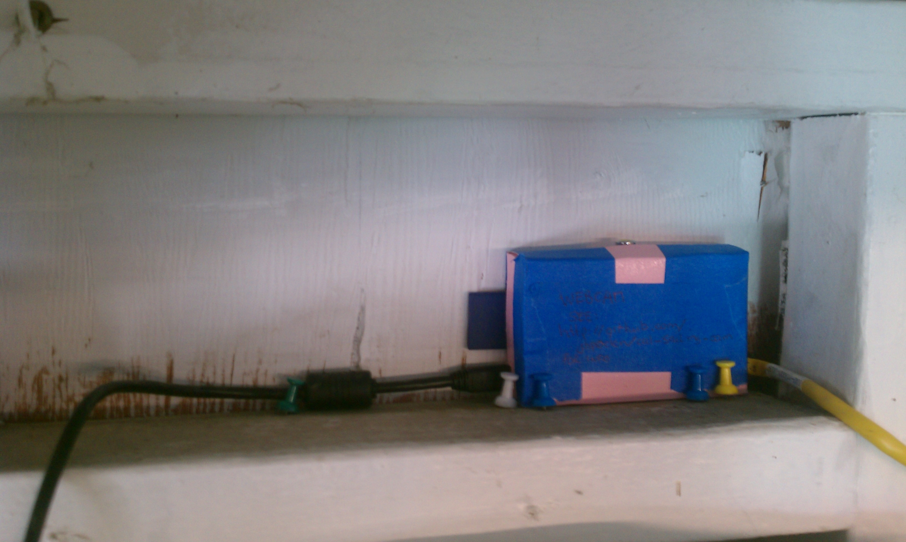

# Setup 
 1. 2 webcams of model linksys/ cisco WVC80N with fixed ip addresses (cam-dock:  192.168.1.253, cam-restaurant:  192.168.1.252) connected to cal-sailing router through WiFi
 2. configured raspberry pi model B connected with ethernet cable to cal-sailing internet router

# Pi In Action


# Sequence

Every minute, the pi downloads the script update_cam.sh from github and executes it. 

The script captures images from two webcams with a HTTP GET using curl. 

Then the scripts sends the images to cal-sailing.appspot.com with a HTTP POST using curl.

# Troubleshooting 

If the pi has troubles, you can used the following credentials to login to the pi and troubleshoot.  There should be a logfile called update_cam.log with information.

At the clubhouse, connect to the interwebs and login using something like
```
ssh pi@raspberrypi.local
```
You'll be prompted for a password.  The password is the minimum wind speed at which a junior sailing test can be administered.

# Rebuilding the Raspberry Pi

In case the raspberry pi dies, or gets injured, please follow these steps to create a new one.

 1. Image SD Card (4 GB min) with Raspbian “wheezy” image (see http://www.raspberrypi.org/downloads for more info).
 2. Connect pi to network using ethernet, use router to figure out which ip address pi got
 3. Login ```ssh pi@[ip address]``` with default password (see http://www.raspberrypi.org/downlaod for more info).
 4. Change password to club password (see above) using ```passwd```
 4. Setup avahi/zeroconf to allow easy login through raspberrypi.local (just google "avahi zeroconf raspberry pi")
 5. Edit crontab using ```crontab -e```
 6. add crontab job to send images ```* * * * * sh -c "`curl --silent https://raw.github.com/jhpoelen/cal-sailing-cam/master/update_cam.sh`" >> /home/pi/update_cam.log 2>&1```
 7. add contrab to clean logs every day at midnight ```0 0 * * * rm /home/pi/update_cam.log 2>&1``` 
 8. save crontab and . . . you're done.
