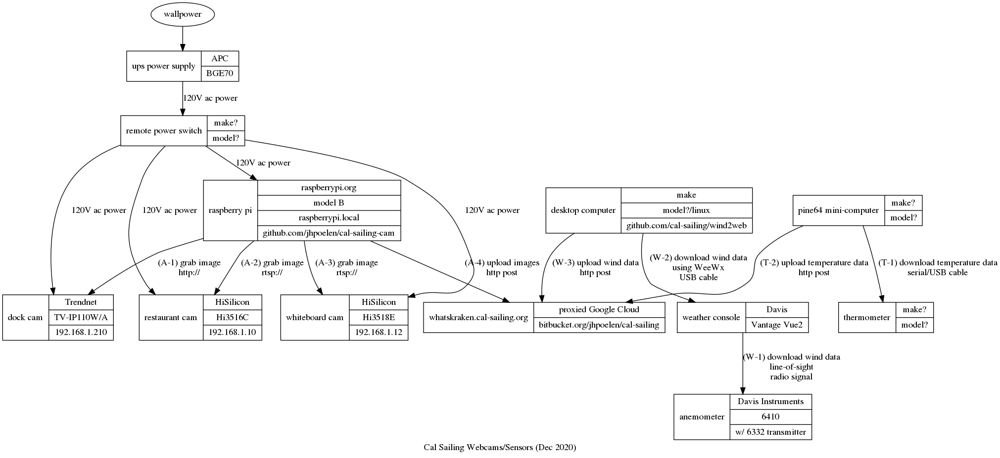

This page describes the webcam setup at the cal-sailing club in Berkeley, CA.  This setup is used (time of writing July 2013) to publish cam images to webcam at http://cal-sailing.appspot.com/wind using https://bitbucket.org/jhpoelen/cal-sailing .

# Setup
 1. 3 webcam of model linksys/ cisco WVC80N (dock), [HiSilicon Hi3516C](http://www.hkvstar.com/pdf/Hi3516C.pdf) (restaurant), and [HiSilicon Hi3518E](http://support.hkvstar.com/file/Hi3518E.pdf) (whiteboard) with fixed ip addresses (dock:  192.168.1.253, restaurant:  192.168.1.10, whiteboard: 192.168.1.12) connected to cal-sailing router with ethernet cables.
 2. configured raspberry pi model B connected with ethernet cable to cal-sailing internet router
 3. uses UPS to power webcams and raspberry pi to smooth out temperamental power supply
 4. remote IP power switch to remotely restart raspberry pi / cams in case they get stuck 
 5. anenometer to keep track of local wind conditions
 6. thermometer to measure local outside temperature
 7. configured pine64 and desktop computers to get data from sensors to the appspot server



# What does the raspberry pi look like?
## On the outside, with paper case

## On the inside
Notice that a happy pi, as shown below, has red (power), green (network activity), yellow (network link) lights on. The lights can be seen in top right corner in picture.


# Sequence

Every minute, the pi downloads the script [update_cam.sh](https://github.com/jhpoelen/cal-sailing-cam/blob/master/update_cam.sh) from github and executes it. 

The script captures images from two webcams with a HTTP GET using curl. 

Then the scripts sends the images to cal-sailing.appspot.com with a HTTP POST using curl.

# Troubleshooting 

If the pi has troubles, you can used the following credentials to login to the pi and troubleshoot.  There should be a logfile called update_cam.log with information.

At the clubhouse, connect to the club's wifi and login using something like
```
ssh pi@raspberrypi.local
```
You'll be prompted for a password.  The password is the minimum wind speed at which a junior sailing test can be administered.

If you can't access the raspberry pi, then it is possible that the pi is (a) missing / destroyed (b) sdcard has become loose or detached (c) has no power or (d) is not connected to router / internet. Please open an issue [here](http://bitbucket.org/jhpoelen/cal-sailing/issues/new) if you can't fix it yourself.

# Rebuilding the Raspberry Pi

In case the raspberry pi dies, or gets injured, please follow these steps to create a new one.

 1. Image SD Card (4 GB min) with Raspbian “wheezy” image (see http://www.raspberrypi.org/downloads for more info).
 2. Connect pi to network using ethernet, use router to figure out which ip address pi got
 3. Login ```ssh pi@[ip address]``` with default password (see http://www.raspberrypi.org/downloads for more info).
 4. Change password to club password (see above) using ```passwd```
 4. Setup avahi/zeroconf to allow easy login through raspberrypi.local (just google "avahi zeroconf raspberry pi")
 5. Edit crontab using ```crontab -e```
 6. add crontab job to send images ```* * * * * sh -c "`curl -L --silent https://raw.github.com/jhpoelen/cal-sailing-cam/master/update_cam.sh`" >> /home/pi/update_cam.log 2>&1```
 7. add contrab to clean logs every day at midnight ```0 0 * * * rm /home/pi/update_cam.log 2>&1``` 
 8. save crontab and . . . you're done.
