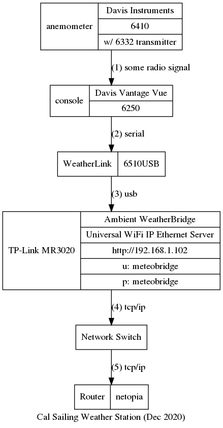

This page describes the setup of the weather station at [cal sailling club](http://cal-sailing.org). The weather station is supposed to report data to https://www.wunderground.com/personal-weather-station/dashboard?ID=KCABERKE32 .

# documentation

[Davis Vantage Serial Protocol Docs](http://www.davisnet.com/support/weather/download/VantageSerialProtocolDocs_v261.pdf)

